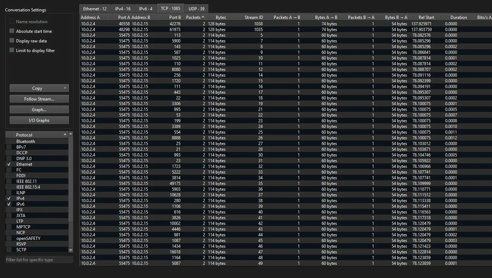
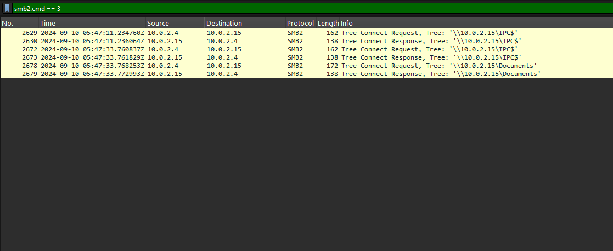
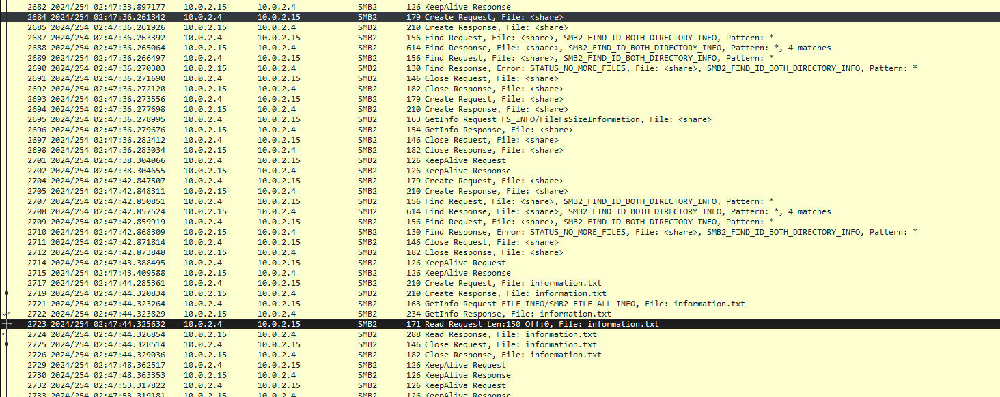
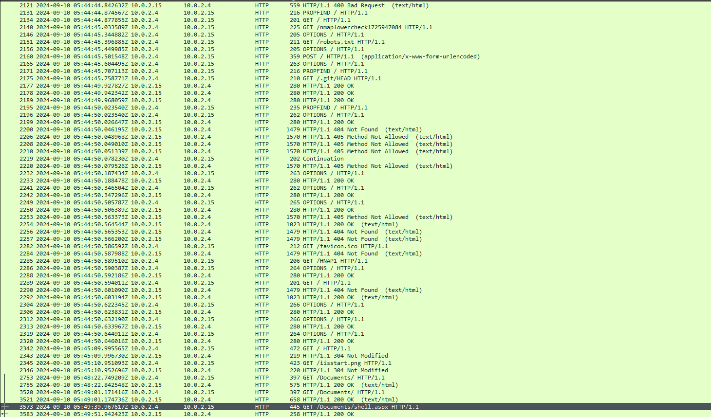
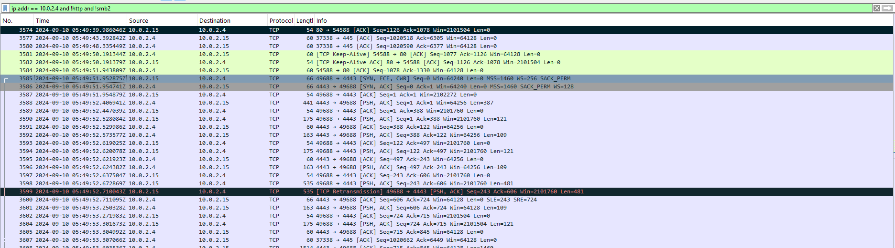
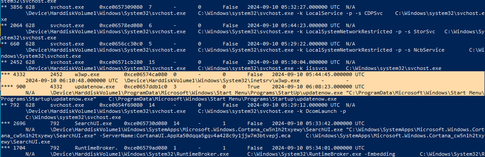
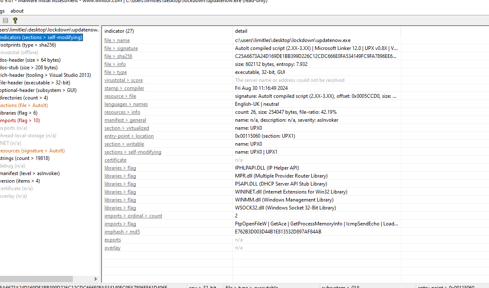
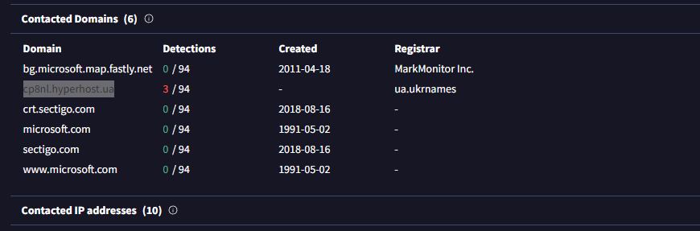
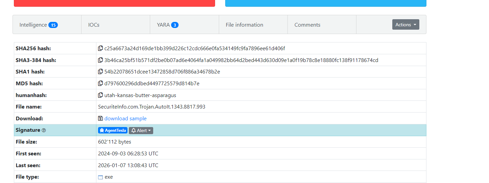

# Lockdown — DFIR Analysis

**Plataforma:** CyberDefenders 
**Categoría:** Network Forensics 
**Dificultad:** Easy 
**Fecha:** 2025-04-01

---

# Executive Summary

Un atacante ingresó al sistema explotando una mala configuración de seguridad en un servidor web IIS, accediendo mediante enumeración SMB sin credenciales válidas. 
Una vez dentro, subió una webshell y la ejecutó para obtener acceso remoto. Además, instaló un ejecutable malicioso en la carpeta Startup de Windows para mantener persistencia, 
consistente con el comportamiento conocido de esta familia de malware (AgentTesla), orientada al robo de credenciales y exfiltración de información hacia su servidor de C2.

---

# Tools Used

|Herramienta | Propósito |
|---|---|
| **Wireshark** |Análisis de tráfico de red |
| **Volatility 3**  | Análisis de volcado de memoria |
| **PeStudio**      | Análisis estático de malware |
| **Virus Total** | Investigación OSINT |
| **MalwareBazaar** | Investigación OSINT | 

---

# Analysis 

## Reconnaissance

Se identificó un escaneo de puertos hacia el host víctima (10.0.2.15) originado desde 10.0.2.4. El patrón fue detectado en Wireshark → Statistics → Conversations → TCP, donde se observa que desde el puerto 55475 del atacante se enviaron exactamente 2 paquetes hacia múltiples puertos distintos de la víctima — comportamiento característico de un SYN scan (Nmap).



**Herramienta:** Wireshark  

**MITRE: T1046 — Network Service Discovery**


## Discovery

El atacante identificó el puerto 445 (SMB) abierto en el host víctima y realizó una enumeración de recursos compartidos para determinar cuáles estaban disponibles.

```
smb2.cmd == 3
```


Mediante este filtro en Wireshark se identificaron dos Tree Connect Requests hacia los siguientes shares:

| Share | Descripción |
|---|---|
| `\\10.0.2.15\IPC$` | Share especial de Windows usado para enumeración de recursos, usuarios y servicios. Accesible sin credenciales en configuraciones inseguras. |
| `\\10.0.2.15\Documents` | Share de archivos expuesto por IIS, con permisos de escritura que permitieron al atacante subir contenido malicioso. |

**Herramienta:** Wireshark  

**MITRE:** T1135 — Network Share Discovery


## Initial Access - Web-Shell

El atacante se autenticó en el share SMB como `WORKGROUP\root`, posiblemente con credenciales por defecto o null session. Una vez dentro, exploró el contenido del share `Documents` donde identificó 4 archivos/carpetas disponibles (`Find Response: 4 matches`).

Luego abrió `information.txt`, consultó su metadata (`FILE_ALL_INFO`) y leyó su contenido (150 bytes) para entender qué había en el share antes de actuar.

```
smb2
```


Con esa información, el atacante procedió a subir `shell.aspx` al share mediante un **SMB2 Write Request** de **1015024 bytes**, aprovechando que el share era web-accessible a través de IIS.

**Herramienta:** Wireshark  

**MITRE:** T1505.003 — Server Software Component: Web Shell


## Execution

Previo a la ejecución de la webshell, el atacante realizó una enumeración web automatizada sobre el servidor IIS mediante requests HTTP — `GET /robots.txt`, `GET /.git/HEAD`, `PROPFIND`, `OPTIONS` — probablemente con una herramienta de scanning como Nmap o un scanner web. El servidor respondió con códigos `404 Not Found` y `405 Method Not Allowed` en la mayoría de los casos.

Una vez completado el reconocimiento, el atacante ejecutó la webshell accediendo a ella vía HTTP:

```
GET /Documents/shell.aspx HTTP/1.1
```



Esto fue identificado en Wireshark filtrando por tráfico HTTP y localizando el request al path `/Documents/shell.aspx` (paquete 3573, timestamp `02:49:39`).

Inmediatamente después de la ejecución, se estableció una conexión TCP de reverse shell desde la víctima hacia el atacante en el puerto **4443**, identificada con el filtro:

```
ip.addr == 10.0.2.4 and !http and !smb2
```



**Herramienta:** Wireshark 

**MITRE:** T1059 — Command and Scripting Interpreter / T1071 — Application Layer Protocol


## Persistence

Desde la webshell, el atacante dropeó y ejecutó un binario malicioso para establecer persistencia en el sistema. Para identificarlo, analicé el árbol de procesos en el volcado de memoria con Volatility 3:

```
python.exe .\vol.py -f 'C:\Users\limitles\Desktop\lockdown\memdump.mem' windows.pstree
```



Se identificó que `w3wp.exe` (PID 4332) tenía un proceso hijo inusual — `updatenow.exe` (PID 900) — ejecutándose desde la carpeta Startup de Windows, lo que confirma que fue dropeado y lanzado directamente por la webshell.

```
C:\ProgramData\Microsoft\Windows\Start Menu\Programs\Startup\updatenow.exe
```

Al ubicarse en la carpeta Startup, el ejecutable se lanzará automáticamente cada vez que el sistema inicie, garantizando persistencia al atacante.

**Herramienta:** Volatility 3  

**MITRE:** T1547.001 — Boot or Logon Autostart Execution: Startup Folder


## Malware Analysis & Threat Intelligence

El ejecutable `updatenow.exe` fue analizado estáticamente con PEStudio, revelando múltiples indicadores.

**Análisis estático — PEStudio**



| Indicador | Detalle |
|---|---|
| SHA256 | `C25A6673A24D169DE1BB399D226C12CDC666E0FA534149FC9FA7896EE61D406F` |
| MD5 | `E762B3D003D44B1E813532D897AF84AB` |
| Tamaño | 602112 bytes |
| Entropía | 7.932 (alta — indica compresión o cifrado) |
| Packer | UPX v0.8X — secciones `UPX0` y `UPX1` detectadas |
| Compilador | AutoIt (Fri Aug 30 2024) |
| Tipo | Ejecutable 32-bit, GUI |

Las librerías importadas — `WSOCK32.dll`, `WININET.dll`, `IPHLPAPI.dll` — sugieren capacidades de red, comunicación HTTP y manipulación de interfaces de red.

**Investigación OSINT**

El hash SHA256 fue buscado en VirusTotal y Google, asociando la muestra a la familia **AgentTesla** — un infostealer/RAT conocido con capacidades de keylogging, robo de credenciales y exfiltración de datos.





| Fuente | Hallazgo |
|---|---|
| VirusTotal | 3/94 detecciones para dominio C2 `cp8nl.hyperhost.ua` |
| MalwareBazaar | Familia: AgentTesla — `SecuriteInfo.com.Trojan.AutoIt.1343` |

**Herramientas:** PEStudio, VirusTotal, MalwareBazaar, Google  

**MITRE:** T1027 — Obfuscated Files or Information (UPX packing)

## MITRE ATT&CK Mapping

| ID | Técnica |
|---|---|
|T1046 |Network Service Discovery (Reconnaissance)|
| T1135 | Network Share Discovery (Discovery)|
| T1505.003 | Web Shell (Initial Access)|
| T1059 | Command and Scripting Interpreter (Execution)|
| T1071 | Application Layer Protocol (Execution)|
| T1547.001 | Startup Folder (Persistence)|
| T1027 | Obfuscated Files or Information (Malware)|


## IOC Summary

| Tipo | Valor | Descripción |
|---|---|---|
| SHA256 | `C25A6673A24D169DE1BB399D226C12CDC666E0FA534149FC9FA7896EE61D406F` | Hash de updatenow.exe |
| MD5 | `E762B3D003D44B1E813532D897AF84AB` | Hash de updatenow.exe |


## Conclusion

Un atacante realizó un reconocimiento activo sobre el servidor IIS, identificando el puerto 445 (SMB) abierto. Aprovechando una mala configuración de seguridad, accedió al share `Documents` sin credenciales válidas, exploró su contenido y subió una webshell (`shell.aspx`). Al ejecutarla vía HTTP, estableció un reverse shell hacia su equipo en el puerto 4443, obteniendo acceso remoto al servidor. Desde ese acceso, dropeó `updatenow.exe` en la carpeta Startup de Windows para garantizar persistencia entre reinicios. El análisis estático e OSINT del binario lo asoció con la familia **AgentTesla** — un infostealer con capacidades de robo de credenciales, keylogging y comunicación con C2 — siendo `cp8nl.hyperhost.ua` el dominio identificado como servidor de comando y control.

